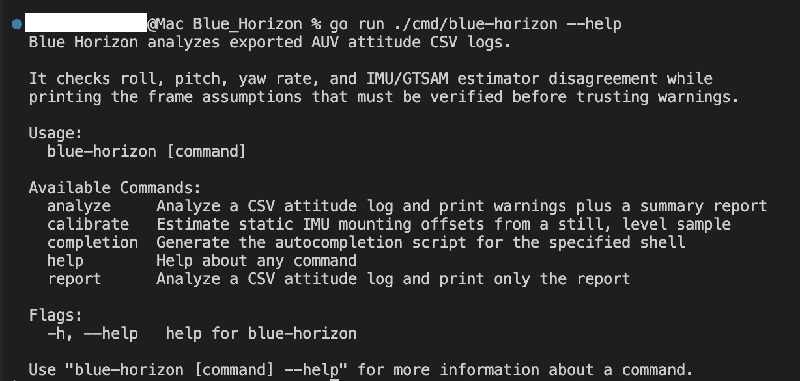
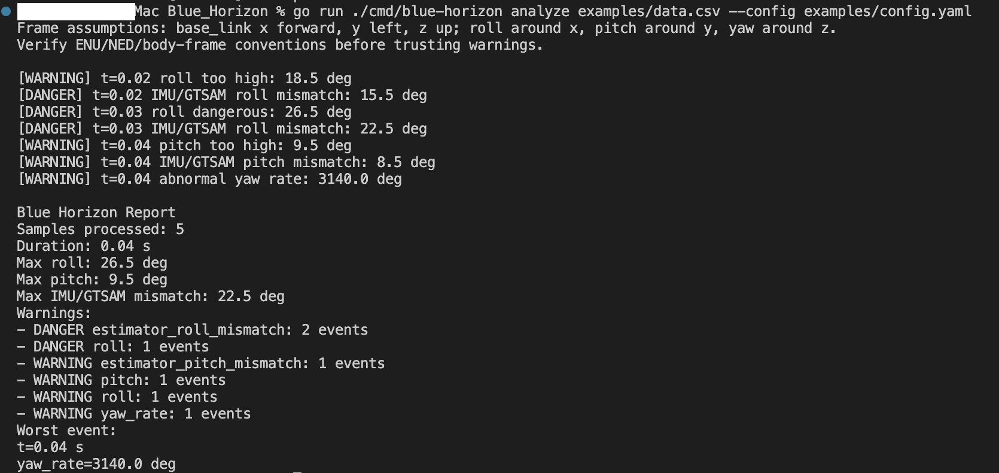
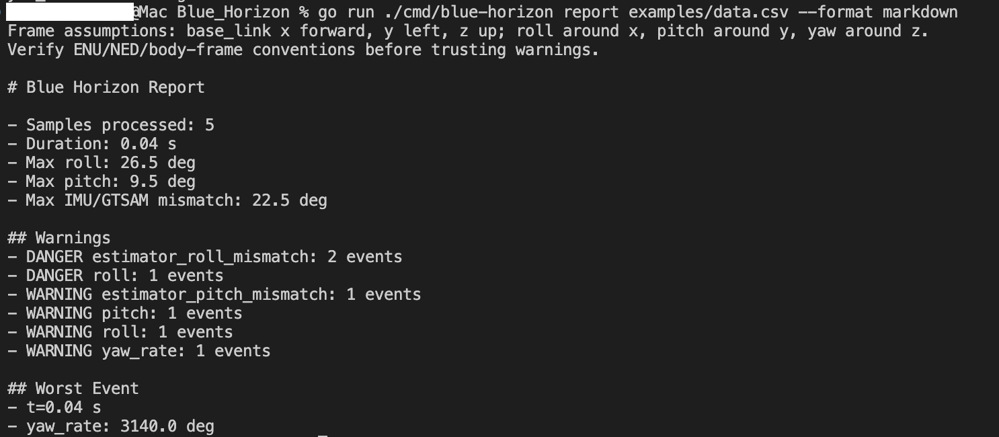
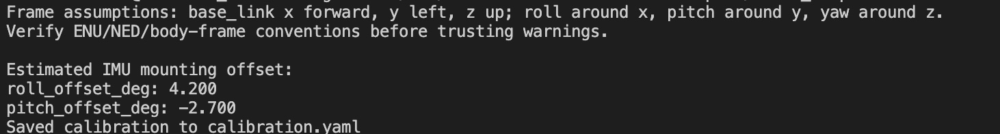

# Blue Horizon

A Go command-line diagnostic tool for autonomous underwater vehicle attitude logs.

Blue Horizon answers one practical question:

> Is the AUV body attitude physically reasonable right now?

It starts as an offline CSV analyzer. Feed it exported IMU and estimator attitude data, and it will flag excessive roll, excessive pitch, abnormal yaw rate, and disagreement between raw IMU attitude and the GTSAM/state-estimator attitude.

## What It Can Do

Given this CSV:

```csv
time,imu_roll_deg,imu_pitch_deg,imu_yaw_deg,gtsam_roll_deg,gtsam_pitch_deg,gtsam_yaw_deg,depth_m
0.00,1.2,-0.5,10.0,1.0,-0.3,10.1,0.2
0.01,1.4,-0.6,10.1,1.1,-0.4,10.2,0.2
0.02,18.5,-2.0,10.3,3.0,-0.6,10.3,0.2
0.03,26.5,-3.0,10.6,4.0,-0.7,10.5,0.3
0.04,2.0,9.5,42.0,1.8,1.0,11.0,0.3
```

Run:

```sh
go run ./cmd/blue-horizon analyze examples/data.csv --config examples/config.yaml
```

Example output:

```text
Frame assumptions: base_link x forward, y left, z up; roll around x, pitch around y, yaw around z.
Verify ENU/NED/body-frame conventions before trusting warnings.

[WARNING] t=0.02 roll too high: 18.5 deg
[DANGER] t=0.02 IMU/GTSAM roll mismatch: 15.5 deg
[DANGER] t=0.03 roll dangerous: 26.5 deg
[DANGER] t=0.03 IMU/GTSAM roll mismatch: 22.5 deg
[WARNING] t=0.04 pitch too high: 9.5 deg
[WARNING] t=0.04 IMU/GTSAM pitch mismatch: 8.5 deg
[WARNING] t=0.04 abnormal yaw rate: 3140.0 deg

Blue Horizon Report
Samples processed: 5
Duration: 0.04 s
Max roll: 26.5 deg
Max pitch: 9.5 deg
Max IMU/GTSAM mismatch: 22.5 deg
Warnings:
- DANGER estimator_roll_mismatch: 2 events
- DANGER roll: 1 events
- WARNING estimator_pitch_mismatch: 1 events
- WARNING pitch: 1 events
- WARNING roll: 1 events
- WARNING yaw_rate: 1 events
Worst event:
t=0.04 s
yaw_rate=3140.0 deg
```

That output says:

- At `t=0.02`, roll is already above the warning threshold.
- At `t=0.03`, roll is beyond the danger threshold.
- The IMU and GTSAM roll estimates disagree strongly, which can point to estimator divergence, a bad frame transform, bad timestamp alignment, or an IMU mounting issue.
- At `t=0.04`, pitch is high and the yaw angle changes sharply enough to trigger a yaw-rate warning.

## Install

Install Go, then verify:

```sh
go version
```

The command interface is built with [Cobra](https://github.com/spf13/cobra), the same Go CLI framework used by many production command-line tools. The analyzer itself stays small and uses plain Go packages behind the CLI layer.

## Build

```sh
go build -o blue-horizon ./cmd/blue-horizon
```

Then run:

```sh
./blue-horizon analyze examples/data.csv
```

You can also run directly without building:

```sh
go run ./cmd/blue-horizon analyze examples/data.csv
```

## Terminal Demonstrations

Root help shows the available Cobra commands:

```sh
go run ./cmd/blue-horizon --help
```



Analyze a CSV and print warnings plus the text report:

```sh
go run ./cmd/blue-horizon analyze examples/data.csv --config examples/config.yaml
```



Generate a markdown report:

```sh
go run ./cmd/blue-horizon report examples/data.csv --format markdown
```



Estimate IMU mounting offsets from a still, level sample:

```sh
go run ./cmd/blue-horizon calibrate examples/still_sample.csv
```



## Commands

Analyze a CSV with default thresholds:

```sh
go run ./cmd/blue-horizon analyze examples/data.csv
```

Analyze with a threshold config:

```sh
go run ./cmd/blue-horizon analyze examples/data.csv --config examples/config.yaml
```

Generate a markdown report:

```sh
go run ./cmd/blue-horizon report examples/data.csv --format markdown
```

Estimate IMU mounting offsets from a still, level sample:

```sh
go run ./cmd/blue-horizon calibrate examples/still_sample.csv
```

Example calibration output:

```text
Estimated IMU mounting offset:
roll_offset_deg: 4.200
pitch_offset_deg: -2.700
Saved calibration to calibration.yaml
```

Analyze with calibration applied:

```sh
go run ./cmd/blue-horizon analyze examples/data.csv --config examples/config.yaml --calibration calibration.yaml
```

## CSV Format

Required headers:

```csv
time,imu_roll_deg,imu_pitch_deg,imu_yaw_deg,gtsam_roll_deg,gtsam_pitch_deg,gtsam_yaw_deg,depth_m
```

Column meanings:

- `time`: sample time in seconds
- `imu_roll_deg`, `imu_pitch_deg`, `imu_yaw_deg`: raw IMU attitude in degrees
- `gtsam_roll_deg`, `gtsam_pitch_deg`, `gtsam_yaw_deg`: estimator attitude in degrees
- `depth_m`: vehicle depth in meters

## Config

Thresholds are configured with a simple YAML file:

```yaml
roll_warning_deg: 10
roll_danger_deg: 25
pitch_warning_deg: 8
pitch_danger_deg: 20
estimator_mismatch_warning_deg: 7
estimator_mismatch_danger_deg: 15
yaw_rate_warning_deg_s: 30
```

The default values match [examples/config.yaml](examples/config.yaml).

## Detection Rules

Roll and pitch checks use calibrated IMU attitude:

```text
corrected_roll = imu_roll_deg - roll_offset_deg
corrected_pitch = imu_pitch_deg - pitch_offset_deg
```

Warnings are emitted when absolute corrected roll or pitch exceeds the warning threshold. Danger events are emitted when they exceed the danger threshold.

Estimator mismatch compares corrected IMU roll/pitch against GTSAM roll/pitch:

```text
abs(corrected_roll - gtsam_roll_deg)
abs(corrected_pitch - gtsam_pitch_deg)
```

Yaw rate is computed from wrapped yaw deltas so transitions across `-180` and `180` degrees are handled correctly.

## Frame Assumptions

The tool assumes `base_link` uses:

- x forward
- y left
- z up

Roll is rotation around x. Pitch is rotation around y. Yaw is rotation around z.

Always verify ENU/NED/body-frame conventions before trusting warnings. Many attitude bugs come from frame convention mismatches, quaternion ordering confusion, degrees/radians confusion, timestamp mismatch, or a transform between the IMU frame and `base_link` that is not what the estimator expects.

## Project Layout

```text
cmd/blue-horizon/       CLI entrypoint
internal/analyzer/      detection rules and analysis summary
internal/attitude/      angle helpers
internal/calibration/   IMU offset estimation and loading
internal/config/        threshold config loading
internal/input/         CSV parser
internal/report/        text and markdown reports
examples/               sample input data and config
tests/                  sample test fixtures
```

## Test

```sh
go test ./...
```

If your environment blocks Go's default cache directory, set `GOCACHE` inside the repo:

```sh
GOCACHE="$PWD/.gocache" go test ./...
```

## Roadmap

- Add more report formats.
- Add CSV tail mode for near-live monitoring.
- Add UDP or WebSocket live input.
- Add a small ROS 2 bridge that exports data to this Go tool.
- Keep native ROS 2 Go bindings out of the first version.
